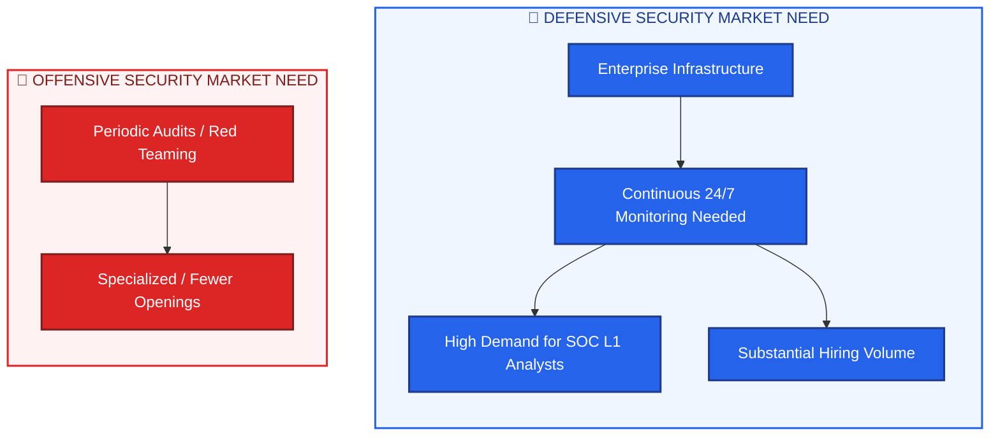
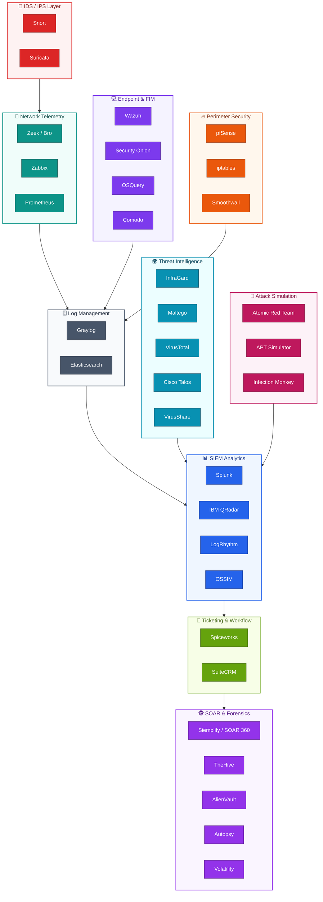
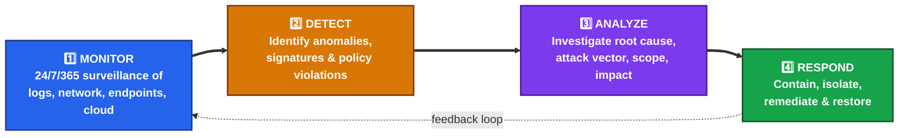
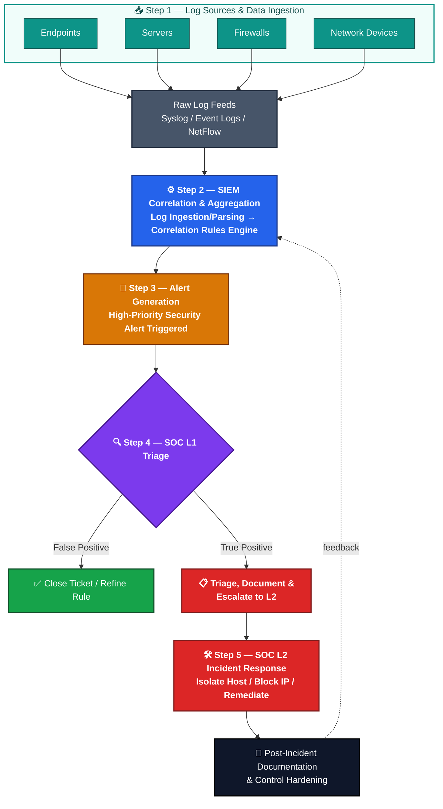
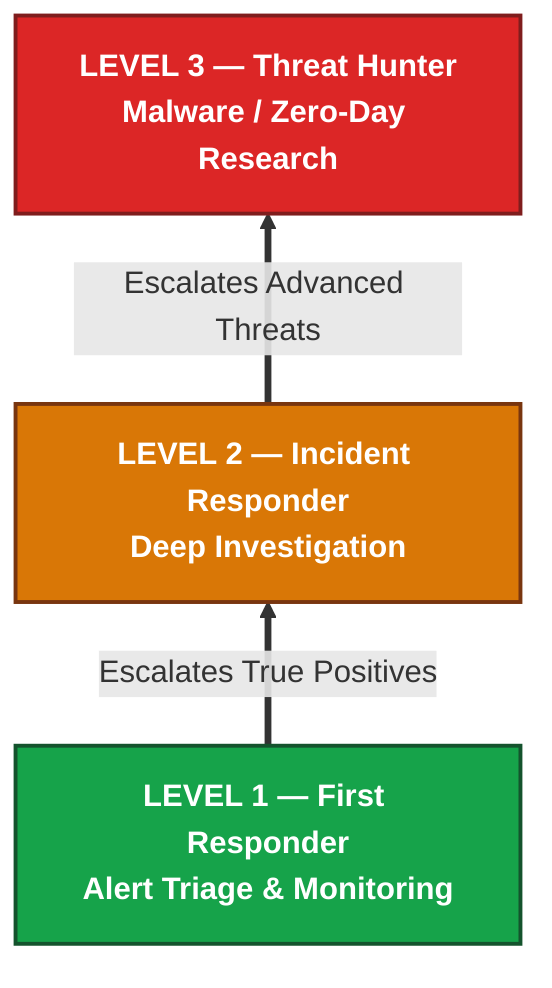

# 🛡️ SOC Analyst L1 Training — Day 1 Notes

> [!info] Course Tag
> #cybersecurity #soc #blue-team #day1 #siem

---

## 1. 📋 Course Overview & Logistics

### 1.1 Program Background & Objectives
- **Course name:** SOC Analyst L1 From Basic to Advance
- **Format:** Structured **30-day** training curriculum (expandable to **35+ days**)
- **Goal:** Transition students, freshers, and IT professionals into job-ready **Blue Team SOC analysts**
- **Approach:** Real-world workflows, hands-on labs, log analysis, threat detection, and practical incident response — not purely theoretical

### 1.2 Instructor Profile & Credentials

| Attribute | Detail |
| :--- | :--- |
| **Name** | Sumit Jain |
| **Current Role** | Penetration Testing Trainer & Consultant |
| **Experience** | 10+ years — Ethical Hacking, VAPT, Red Team Operations |
| **Specializations** | Blue & Red Team Operations, Threat Detection, Incident Response |
| **Mission** | Mentoring the next generation of cybersecurity defenders |
| **LinkedIn** | 35,000+ followers |
| **Telegram** | Official channel for docs, guides, lab files, PDFs |
| **YouTube** | **ZeroDayVault** (formerly *Cyber Security Zone*) |

### 1.3 Course Delivery Format & Resources
- **Live schedule:** Mon / Wed / Fri — **8:30 PM IST**
- **Cost:** 100% Free — all sessions archived permanently on YouTube (**SOC Analyst L1** playlist)
- **Duration:** 30 core days + 5+ bonus days (labs, mock interviews)
- **Tools:**
  - Live chat Q&A during streams
  - Google Sheet tracker (linked in video descriptions) for daily practicals & progress

> [!tip] Resource Hub
> Telegram = primary distribution point for PDFs, lab guides & tool links.

---

## 2. 🌐 Cybersecurity Career Domains & Market Analysis

### 2.1 The 5 Primary Domains

```mermaid
flowchart TD
    ROOT(("🌐 Cybersecurity"))

    ROOT --> OFF["⚔️ Offensive Security"]
    OFF --> OFF1[Pen Testing]
    OFF --> OFF2[Bug Bounty]
    OFF --> OFF3[Red Team]

    ROOT --> DEF["🛡️ Defensive Security"]
    DEF --> DEF1[SOC Operations]
    DEF --> DEF2[Threat Hunting]
    DEF --> DEF3[Digital Forensics]

    ROOT --> RES["🔬 Research"]
    RES --> RES1[Vulnerability Research]
    RES --> RES2[Reverse Engineering]
    RES --> RES3[Threat Intel]

    ROOT --> ENG["🏗️ Engineering"]
    ENG --> ENG1[DevSecOps]
    ENG --> ENG2[Cloud Security]
    ENG --> ENG3[Secure Architecture]

    ROOT --> OFC["👔 Officer / Leadership"]
    OFC --> OFC1[CISO / CSO]
    OFC --> OFC2[Data Privacy]
    OFC --> OFC3[Compliance]

    classDef root fill:#1e293b,stroke:#0f172a,stroke-width:2px,color:#ffffff,font-weight:bold
    classDef offensive fill:#dc2626,stroke:#7f1d1d,stroke-width:2px,color:#ffffff
    classDef defensive fill:#2563eb,stroke:#1e3a8a,stroke-width:2px,color:#ffffff
    classDef research fill:#7c3aed,stroke:#4c1d95,stroke-width:2px,color:#ffffff
    classDef engineering fill:#0d9488,stroke:#134e4a,stroke-width:2px,color:#ffffff
    classDef officer fill:#d97706,stroke:#78350f,stroke-width:2px,color:#ffffff
    classDef leaf fill:#f8fafc,stroke:#94a3b8,stroke-width:1px,color:#0f172a

    class ROOT root
    class OFF offensive
    class DEF defensive
    class RES research
    class ENG engineering
    class OFC officer
    class OFF1,OFF2,OFF3,DEF1,DEF2,DEF3,RES1,RES2,RES3,ENG1,ENG2,ENG3,OFC1,OFC2,OFC3 leaf
```

### 2.2 Sub-Domain Role Mapping

| Primary Domain | Roles / Sub-Domains | Core Focus |
| :--- | :--- | :--- |
| **Offensive Security** | Network Pentester, Mobile Pentester, Web App Pentester, App Pentester, Bug Bounty Hunter, Red Teamer, Exploit Developer | Auditing, vulnerability discovery, adversary simulation, exploit writing |
| **Defensive Security** | Mobile App Security Specialist, Source Code Auditor, App Security Expert, Threat Hunter, Blue Team Member, Digital Forensics Analyst, InfoSec Analyst, Incident Responder, Malware Analyst, Cyber Intel Specialist, **SOC Analyst (L1/L2/L3)** | Real-time monitoring, log analysis, alert triage, host isolation, malware reversing, forensics |
| **Research** | Cyber Security Researcher, Cyber Threat Analyst, OS Research Engineer | Novel threat vectors, APT TTPs, OS security research |
| **Engineering** | DevSecOps Engineer, Cloud Security Engineer, Security Engineer | CI/CD security, cloud hardening (AWS/Azure/GCP), architecture |
| **Officer Level** | Data Privacy Officer, CISO, CSO | Risk management, compliance (GDPR, HIPAA, ISO 27001), policy |

### 2.3 Offensive vs Defensive Market Dynamics

- **Educational gap:** Offensive security content (ethical hacking, bug bounty) is widely available online; **structured defensive/SOC training is rare** → beginners struggle with SOC workflows, log collection, SIEM operations.
- **Job market reality:** Despite beginner focus on offensive roles, **Defensive Security (SOC L1) job openings are far higher in volume**. Nearly every enterprise needs a dedicated/managed SOC team 24/7.
- **CCTV Analogy:**
  - Physical security uses **CCTV** to monitor facilities & catch intruders in real time.
  - A **SOC** does the same digitally — monitoring network traffic, endpoints, and cloud infra.
  - Vulnerability patching = locking doors (prevention). **SOC analyst = actively stopping live attacks** (Brute Force, DoS, Malware) *as they happen*.

---

## 3. 🗓️ The Exhaustive 30-Day SOC Analyst L1 Roadmap

| Day | Topic | Nature | Key Deliverables |
| :--- | :--- | :--- | :--- |
| **1** | Series Introduction & SOC Fundamentals | Theoretical | Curriculum overview, SOC definition, career domains |
| **2** | SOC Structure, Roles & Responsibilities | Theoretical | SOC tiers (L1/L2/L3), career growth paths |
| **3** | Cybersecurity Core Principles & Threat Actors | Theoretical | CIA Triad, threat actor profiles |
| **4** | Networking Fundamentals | Conceptual | IP addressing, LAN/MAN/WAN, transmission media |
| **5** | Ports, Protocols & Network Models | Networking | Standard ports, OSI 7-layer model, TCP/IP model |
| **6** | Network Devices & Infrastructure | Architecture | Routers, switches, firewalls, load balancers |
| **7** | Windows OS Fundamentals | OS Security | Windows architecture, security subsystems, admin tools |
| **8** | Linux OS Fundamentals | Hands-on CLI | Terminal commands, filesystem hierarchy, permissions |
| **9** | Log Fundamentals & Formats | Core Analytics | Log creation, storage paths, log types/formats |
| **10** | Deep Dive: Windows Event Logs | Deep Dive | Event Log architecture, critical Event IDs |
| **11** | Deep Dive: Linux System Logs | Deep Dive | Syslog, `/var/log`, `auth.log`/`secure` |
| **12** | Introduction to SIEM Technology | Architecture | SIEM concepts, log aggregation, correlation |
| **13** | Top SIEM & Security Tooling Ecosystem | Ecosystem | IDS/IPS, log mgmt, SIEM, SOAR, EDR, threat intel |
| **14** | Basic SIEM Use Cases & Alert Rules | Logic Building | Detection rules, alert thresholds |
| **15** | Q&A & Virtual Lab Environment Setup | Practical | Multi-VM lab, SIEM ingestion simulation |
| **16** | Threat Intelligence Fundamentals | Intelligence | CTI concepts, IOCs, feed integration |
| **17** | MITRE ATT&CK Framework Mapping | Tactical | TTPs, threat mapping |
| **18** | Common Attack Detection Mechanics | Hands-on | Attack pattern ID across logs/PCAP/telemetry |
| **19** | Brute Force Attack Detection | Hands-on | Auth log analysis, lockouts, brute force patterns |
| **20** | Phishing Email Analysis Workflows | Hands-on | Email headers, malicious attachments, sandboxing |
| **21** | Introduction to Malware Analysis | Threat Analysis | Static vs dynamic analysis, execution indicators |
| **22** | Q&A, Quizzes & Practical Scenario Review | Assessment | Scenario-based exercises |
| **23** | SOC L1 Incident Response Workflows | Workflow | IR procedures (Windows & Linux) |
| **24** | Alert Triage Methodologies | Triage | True Positive vs False Positive, escalation |
| **25** | SOC Incident Templates & Documentation | Writing | Reporting formats, ticketing, chain-of-custody |
| **26** | Live Analysis of Real Attack Logs | Live Analysis | Breach logs, adversary progression, timelines |
| **27** | Wireshark Packet Analysis | Deep Dive | Filters, protocol dissection, stream following |
| **28** | Packet Capture (PCAP) Investigation | Deep Dive | Malicious traffic, exfiltration, C2 detection |
| **29** | Full Incident Case Study Walkthrough | Case Study | End-to-end breach: intrusion → containment → report |
| **30** | Career Path, Mindset & Industry Transition | Career | Entry challenges, continuous learning, Blue Team mindset |
| **Bonus 31–35+** | Resume Building & Mock Technical Interviews | Career Accelerator | SOC resumes, mock interviews |

---

## 4. 🧰 SOC Tooling Ecosystem & Technology Stack

### 4.1 Categorized Tooling Architecture

### 4.2 Comprehensive Tooling Matrix

| Category | Tools | Core Function |
| :--- | :--- | :--- |
| **IDS/IPS** | Snort, Suricata | Real-time traffic inspection, signature-based detection, auto-blocking |
| **Network & Infra Monitoring** | Zeek (Bro), Zabbix, Prometheus | Packet → transaction logs, infra health, performance metrics |
| **Log Management** | Graylog, Elasticsearch | Aggregating, indexing, parsing high-volume logs |
| **Endpoint Security & FIM** | Wazuh, Security Onion, OSQuery, Comodo | Process monitoring, file integrity, endpoint detection, SQL-style OS queries |
| **Firewall & Perimeter** | pfSense, iptables, Smoothwall | Traffic filtering, NAT, perimeter defense |
| **Threat Intelligence (TIP)** | InfraGard, Maltego, VirusTotal, Cisco Talos, VirusShare | Reputation scoring, infra mapping, alert enrichment |
| **Attack Emulation** | Red Canary (Atomic Red Team), APT Simulator, Infection Monkey | Adversary technique testing, detection validation |
| **SIEM** | Splunk, IBM QRadar, LogRhythm, OSSIM | Correlation, behavioral analytics, alerting, dashboards |
| **Ticketing** | Spiceworks, SuiteCRM | Incident lifecycle tracking, SLA management |
| **IR / SOAR / Forensics** | Siemplify (SOAR 360), TheHive, AlienVault, Volatility, Autopsy | Playbook automation, case orchestration, memory/disk forensics |

---

## 5. 🏢 SOC Architecture & Fundamentals

### 5.1 Core Definition
> A **Security Operations Center (SOC)** is a centralized organizational unit of dedicated cybersecurity professionals, processes, and technologies whose goal is continuous situational awareness across an organization's digital infrastructure — monitoring, detecting, analyzing, and responding to incidents in real time.

### 5.2 Real-Time Defense vs. Vulnerability Patching

> [!warning] The "Without SOC" Risk
> - **Vulnerability patching fallacy:** Patching weaknesses prevents *future* exploitation but does **not** stop an *ongoing* intrusion.
> - **Without a SOC:** Live attacks — Brute Force, DoS floods, malware execution — proceed **undetected and unhindered**.
> - **With a SOC:** Real-time monitoring allows analysts to spot suspicious behavior mid-attack and intervene **before** data exfiltration or catastrophic damage.

### 5.3 The 4 Core Operational Pillars

| Pillar | Description |
| :--- | :--- |
| **Monitor** | Continuous 24/7/365 surveillance of logs, network streams, cloud telemetry, endpoint activity |
| **Detect** | Identify intrusions/policy violations via correlation rules & anomaly models |
| **Analyze** | Deep investigation of alerts — root cause, attack vector, scope, impact |
| **Respond** | Contain active threats, isolate assets, remediate, restore secure operations |

### 5.4 Key Organizational Functions (5 Key Functions)
1. **Continuous Monitoring** — 24/7 visibility over heterogeneous IT infra logs
2. **Threat Detection** — automated + analyst-driven IOC identification
3. **Incident Response** — structured containment, eradication, recovery
4. **Reporting & Documentation** — incident tickets, audit trails, exec reports, dashboards
5. **Continuous Security Improvement (Feedback Loop)** — post-incident firewall rule updates, SIEM logic refinement, vulnerability patching

### 5.5 SOC Architectural Data Flow (End-to-End)

**Step-by-step logic:**
1. **Log Data Collection** — agents, syslog daemons, API collectors harvest events from Endpoints, Servers, Firewalls, Switches, Databases, Cloud Services
2. **SIEM Correlation & Aggregation** — platform (Splunk, QRadar, Sumo Logic, LogRhythm) normalizes timestamps, parses fields, applies correlation logic
3. **Alert Generation** — baseline threshold breach (e.g., 50 failed SSH logins in 60s + successful login) → automated alert
4. **Analyst Triage & Escalation (L1)** — filters False Positives, gathers context, escalates True Positives with a ticket
5. **Containment, Response & Documentation** — L2/L3 execute playbooks (segment isolation, credential revocation); findings feed back into policy

---

## 6. 🎯 SOC Operational Tiers & Responsibility Hierarchy

### 6.1 Tiered Model Overview

### 6.2 Tier Responsibilities

#### 🟢 SOC Level 1 — First Responder
- Front-line defense operating primary SIEM monitoring consoles
- Continuously monitors incoming SIEM alert queues & event logs
- Collects/extracts log data from Windows & Linux systems
- Performs initial triage: **True Positive** vs **False Positive**
- Opens initial tickets; escalates confirmed threats to Tier 2

#### 🟡 SOC Level 2 — Incident Responder / Investigation Specialist
- Handles escalated incidents requiring deep technical investigation
- Deep log correlation, PCAP analysis, host file-change analysis
- Identifies compromised assets, determines root cause & blast radius
- Executes active containment & remediation playbooks

#### 🔴 SOC Level 3 — Threat Hunter / Senior Security Engineer
- Proactive **Threat Hunting** — finds hidden attacks *without* waiting for alerts
- Advanced malware analysis & reverse engineering
- Responds to **Zero-Day** threats
- Creates custom detection signatures (**YARA, Sigma rules**)
- Designs overarching SOC defense architecture & IR playbooks

### 6.3 Tier Comparison Matrix

| Attribute | SOC L1 | SOC L2 | SOC L3 |
| :--- | :--- | :--- | :--- |
| **Designation** | Triage Analyst / First Responder | Incident Responder / Investigation Specialist | Threat Hunter / Senior Security Engineer |
| **Trigger** | Automated real-time SIEM alerts | Escalated tickets from L1 | Hypothesis-driven hunting & zero-day intel |
| **Focus** | Real-time monitoring, initial log collection, triage | In-depth incident analysis, root cause, containment | Proactive hunting, reverse engineering, zero-day research |
| **Key Skills** | SIEM console ops, basic log parsing, false-positive filtering, ticketing | Advanced traffic analysis, host forensics, CLI-based IR, scripting | Malware disassembly, reverse engineering, custom detection engineering, CTI analysis |
| **Incident Scope** | Standard alerts, initial documentation | Medium–high severity breaches, active containment | APTs, zero-days, complex enterprise compromises |

> [!note] Live Q&A Note
> During the live Q&A, student **Sahil Kashyap** asked how roles differ across SOC tiers — the instructor's breakdown above (L1 → L2 → L3) was given in direct response.

### 6.4 Career Progression & Responsibility Scaling
- **Analogy to offensive security progression:** SOC tiers mirror the growth path of Security Auditing → Vulnerability Assessment (VA) → Penetration Testing (PT).
- As analysts move **L1 → L2 → L3**, operational authority, technical autonomy, and complexity scale significantly.
- Beginners start at **Tier 1** to master monitoring & log triage before advancing to deep investigation and proactive hunting.

---

## 7. 📚 Student Resources & Learning Infrastructure

| Resource                   | Detail                                                                                       |
| :------------------------- | :------------------------------------------------------------------------------------------- |
| **Live Schedule**          | Mon / Wed / Fri, 8:30 PM IST                                                                 |
| **Telegram Channel**       | Primary hub for PDF notes, lab guides, reference docs, tool links                            |
| **Google Sheet Tracker**   | Linked in video descriptions — logs daily practicals, assigns challenges, tracks completion  |
| **Live Session Advantage** | Real-time Q&A, immediate doubt resolution, interactive practical discussion                  |
| **Archive Policy**         | All recordings permanently available on **ZeroDayVault** YouTube — *SOC Analyst L1* playlist |

---

## 🔑 Quick Recap

- [ ] SOC = centralized team + process + tech for 24/7 monitor → detect → analyze → respond
- [ ] Defensive Security (SOC) has **far more job openings** than Offensive Security
- [ ] SOC data flow: **Log Sources → SIEM Correlation → Alert → L1 Triage → L2 Containment → Documentation/Feedback**
- [ ] Tiers: **L1 (Triage) → L2 (Investigation) → L3 (Threat Hunting)**
- [ ] Core tool families: IDS/IPS, SIEM, EDR/FIM, Firewall, TIP, SOAR/Forensics, Ticketing

---

