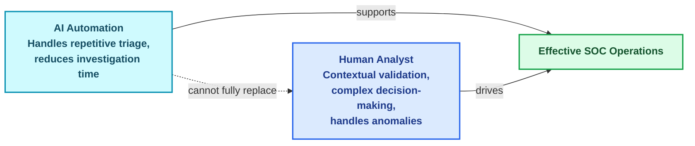
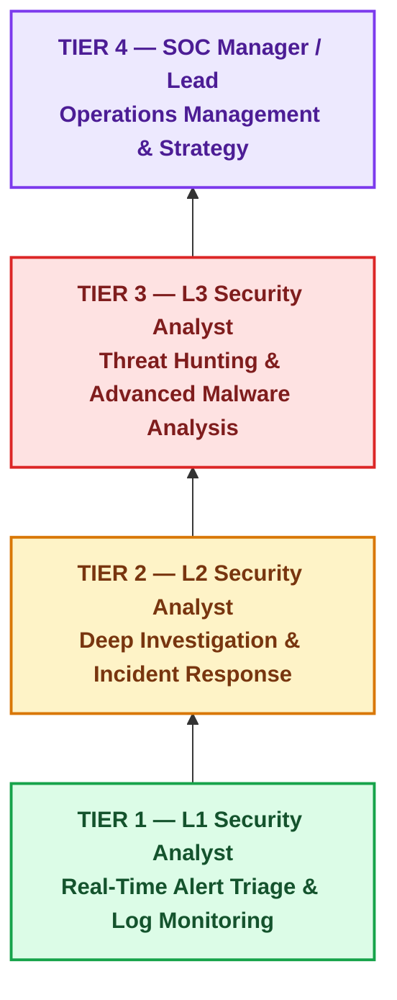
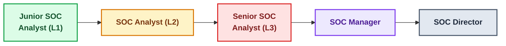
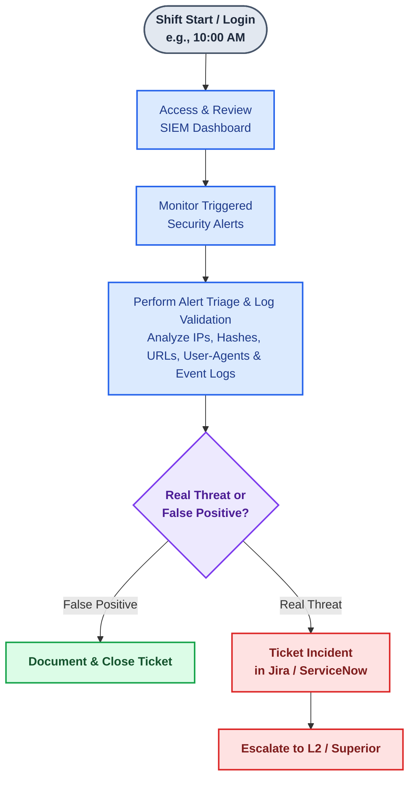
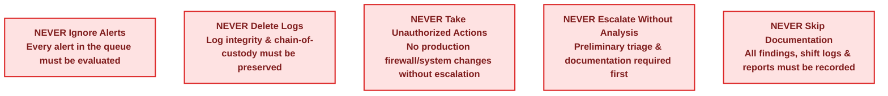
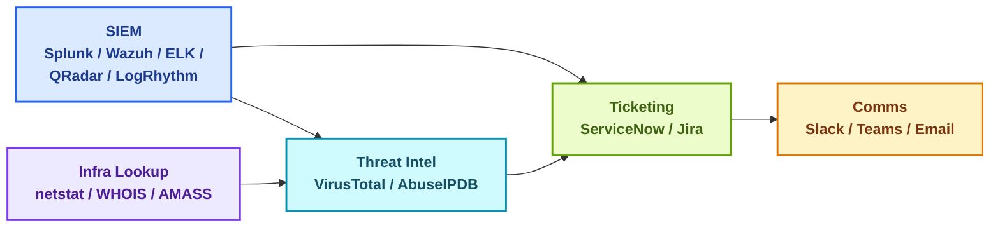
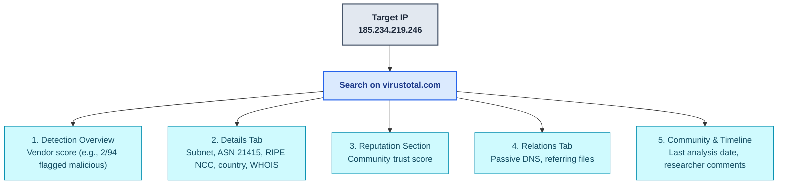
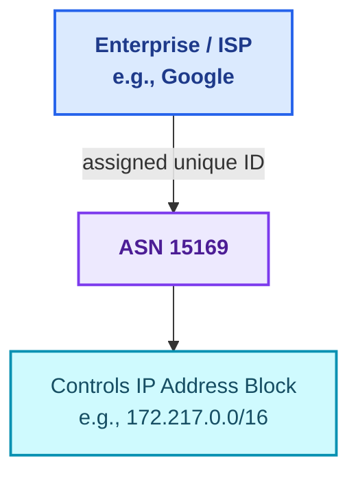
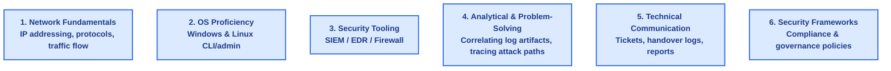
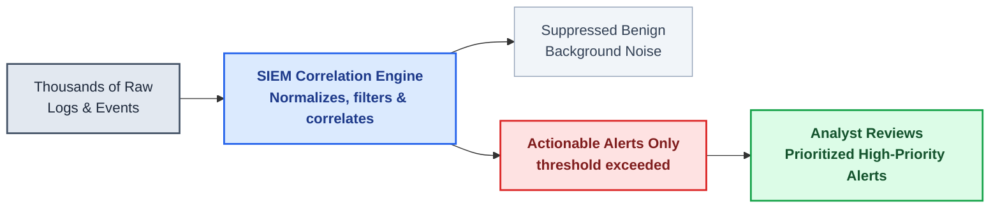

# 🛡️ SOC Analyst L1 Training — Day 2 Notes

> [!info] Course Tag
> #cybersecurity #soc #blue-team #day2 #siem #threat-intel

---

## 1. 🎬 Introduction & Session Objectives

### 1.1 Program Context
- **Host:** Sumit Jain — **ZeroDayVault** YouTube channel, Day 2 of the 30-day SOC Analyst L1 series
- **Core question addressed:** *"What does a SOC Analyst really do on a daily basis?"*

### 1.2 AI vs. Human Role in SOC L1



> [!note] Key Takeaway
> AI automation reduces investigation time and workforce burden, but **cannot replace human analysts entirely** — complex decision-making, contextual validation, and unexpected anomalies still require human critical thinking.

---

## 2. 🏢 SOC Organizational Hierarchy & Tier Breakdown

### 2.1 The 4-Tier Hierarchy Architecture



### 2.2 Detailed Role Specifications

#### 🟢 1. L1 Security Analyst (Junior SOC Analyst)
- **Primary role:** First line of defense in the organization
- **Shift pattern:** **24/7/365 rotational shifts** (not standard 9-to-5) — threats occur continuously
- **Core activities:**
  - Operating **SIEM** consoles to monitor real-time security events
  - Initial alert triage — separating **False Positives** from **True Positives**
  - Routine admin checks (user security awareness, firewall rule tweaks, endpoint settings) *under supervision*
  - Opening tickets for verified alerts, escalating true threats to L2/L3
- **Required skillset:**
  - Foundational Networking protocols/architecture
  - CLI & sysadmin basics — Windows & Linux
  - Basic SIEM operations & log parsing
  - Core understanding of Phishing, Malware, DoS, Brute Force attacks

#### 🟡 2. L2 Security Analyst (Incident Responder)
- **Primary role:** Deep technical investigation & active incident response
- **Core activities:**
  - In-depth analysis of breaches escalated by L1
  - Using **Threat Intelligence feeds**, **EDR** platforms, security analytics tools
  - Determining attack vectors, assessing blast radius, isolating systems, executing containment playbooks

#### 🔴 3. L3 Security Analyst (Threat Hunter / Advanced Analyst)
- **Primary role:** Advanced forensics, proactive threat detection, structural defense engineering
- **Core activities:**
  - **Malware Analysis** & binary **Reverse Engineering**
  - Hypothesis-driven **Threat Hunting** across the enterprise — not reliant solely on automated alerts
  - Researching **Zero-Day Threats**, developing security policies & detection rules
- **Required skillset:** Reverse engineering mastery, digital forensic frameworks, advanced scripting, strategic security planning

#### 🟣 4. SOC Lead & SOC Manager
- **Primary role:** Team operations, strategic planning, inter-departmental coordination
- **Core activities:**
  - Overseeing SOC personnel performance & shift operations (not raw alert analysis)
  - Coordinating workflows between Analysts, Incident Responders, Threat Hunters
  - Managing client SLAs, executive reporting, infrastructure planning

#### ⚙️ 5. Additional Specialized Roles
| Role | Focus |
| :--- | :--- |
| **Incident Responders** | Active breach management, system recovery, containment |
| **Threat Hunters** | Advanced VA/PT, proactive threat hunting |
| **Security Engineers** | Building/configuring security controls, SIEM ↔ IT infra integrations |

### 2.3 Comprehensive Tier Comparison Matrix

| Attribute | L1 Security Analyst | L2 Security Analyst | L3 Security Analyst | SOC Manager / Lead |
| :--- | :--- | :--- | :--- | :--- |
| **Operational Scope** | Alert monitoring, triage, false-positive filtering | Deep incident investigation, containment, response | Advanced malware analysis, threat hunting, zero-days | Team management, workflow planning, governance |
| **Shift Structure** | 24/7/365 Rotational Shifts | Standard / On-Call Rotations | Business Hours / On-Call | Business Hours |
| **Primary Tools** | SIEM dashboards, basic ticketing, basic threat intel | EDR tools, forensic analysis suites, threat intel feeds | Reverse engineering tools, memory forensics, custom YARA/Sigma | Management dashboards, SLA trackers, reporting portals |
| **Trigger Mechanism** | Automated SIEM alerts & incoming log streams | Escalated incident tickets from L1 | Unalerted anomalies, threat hunting hypotheses, zero-days | Operational metrics & compliance audits |

### 2.4 Career Progression Path



---

## 3. 🔄 SOC Daily Operational Workflows & Lifecycle

### 3.1 Daily Shift Lifecycle Flowchart (L1 Analyst)



**Step-by-step logic:**
1. **Shift Login** — analyst logs into workstation, accesses the centralized SIEM dashboard
2. **Alert Monitoring** — alerts triggered by correlation rules are systematically reviewed from the queue
3. **Alert Validation & Triage** — inspect raw logs (IPs, hashes, URLs, user-agents) to verify legitimacy
4. **Ticketing & Documentation** — False Positive → log justification & close; True Positive → open ticket (Jira/ServiceNow)
5. **Escalation** — validated threats documented with preliminary findings, escalated to L2/L3

### 3.2 🚫 Core Rules: What an L1 Analyst Must NEVER Do



---

## 4. 🧰 SOC Tooling Ecosystem & Tech Stack (Day 2)

| Category                          | Primary Tools                                                                                 | Core Purpose                                                                       |
| :-------------------------------- | :-------------------------------------------------------------------------------------------- | :--------------------------------------------------------------------------------- |
| **SIEM**                          | Splunk, Wazuh, ELK Stack (Elasticsearch, Logstash, Kibana), IBM QRadar, LogRhythm, Sumo Logic | Centralized log ingestion, correlation, real-time alerting, visualization          |
| **Ticketing Systems**             | ServiceNow, Jira                                                                              | Incident tracking, triage documentation, SLA management, escalation workflows      |
| **Threat Intelligence Platforms** | VirusTotal (`virustotal.com`), AbuseIPDB (`abuseipdb.com`)                                    | Reputation scoring, multi-vendor signature scanning, IP/domain/hash lookup         |
| **Communication & Collaboration** | Slack, Microsoft Teams, Email                                                                 | Team coordination, incident notifications, shift handovers                         |
| **Infra Lookup & CLI Utilities**  | `netstat` (Windows CLI), WHOIS (`whois.com`, `domaintools.com`, MX Toolbox), AMASS            | Active connection extraction, domain registration lookup, ASN/IP block enumeration |



---

## 5. 🕵️ Practical Threat Intelligence Demos

### 5.1 Command Utility: Extracting Active Connection IPs (`netstat`)

```cmd
netstat 3
```

**Step-by-step:**
1. Open Windows Command Prompt (`cmd.exe`)
2. Run `netstat 3` — refreshes active connection stats every 3 seconds
3. Identify external IPs under the **Foreign Address** column
4. Select active destination IPs (e.g., `185.234.219.246`) for enrichment on VirusTotal/AbuseIPDB
5. **Practical assignment:** run `netstat 3`, pick active connections, do lookups, document findings, post to the Telegram community channel

### 5.2 Demo 1 — Suspicious IP Investigation via VirusTotal

**Scenario:** SIEM flags abnormal auth failures → suspicious source IP `185.234.219.246` (Brute Force Attack trigger)



| UI Tab | Data Points Extracted | Significance |
| :--- | :--- | :--- |
| **Detection Overview** | Vendor score **2/94**; **NTY AVL** flagged malware; AlienVault, Abusix, GreenSnow, MISOFT, Malware Patrol, OpenPhish, Tank, Quick Heal marked clean | Low-to-moderate vendor consensus — requires further investigation |
| **Details Tab** | Subnet range, **ASN 21415**, **RIPE NCC** registry, country, registration data | Organizational ownership & network boundary |
| **Reputation Section** | Community trust score & distribution | Collective crowd-sourced trust metric |
| **Relations Tab** | Passive DNS → `clickandshipwholesale.com` (NS: `ns2`), referring SQL database files | Maps infrastructure dependencies & linked artifacts |
| **Community & Timeline** | Last analysis date, community comments | Crowdsourced context & scan recency |

### 5.3 Demo 2 — IP Investigation via AbuseIPDB

**Steps:** Navigate to `abuseipdb.com` → complete CAPTCHA if prompted → paste IP → **Search/Check** → extract metrics

| Metric | Value |
| :--- | :--- |
| **Target IP** | `185.234.219.246` |
| **Abuse Confidence Score** | 0% (low report volume) |
| **Total Reports** | 1 report from 1 source (~4 years ago) |
| **Network Properties** | ISP, User Type, ASN, Domain Name, Country, City |
| **Report Comment** | *"PHP email form abuse or spam"* |

> [!tip] Root Cause Scenario (Connecting the Dots)
> Combining VirusTotal's referring database files with AbuseIPDB's comment reveals the attack pattern: an **unpatched/vulnerable PHP email form** on a web server was exploited to send bulk spam containing malicious attachments.

**Triage decision:**
- ✅ **Clean** → document metrics, close ticket, baseline monitoring
- 🚨 **Malicious** → document ASN/country/passive DNS/vendor flags, escalate to **L2** for firewall blocking

### 5.4 Demo 3 — Malicious File Investigation via VirusTotal

- **Sample:** EICAR Standard Anti-Virus Test File (`eicar.org`) — a benign string safe for testing AV detection workflows
- **Steps:** Download sample → `virustotal.com` → **File** tab → **Choose File** → upload → inspect report

| UI Tab | Data Points | Significance |
| :--- | :--- | :--- |
| **Detection** | **66/69** vendors flagged malicious; malware family names | High consensus → confirmed True Positive |
| **Details** | MD5 / SHA-1 / SHA-256 hashes; file type (PowerShell/executable); first-seen timestamp; aliases (e.g., `eicr.com`) | Hashes become IOCs for EDR/SIEM blocklists |
| **Relations** | Contacted domains/IPs (C2 endpoints); execution vectors (PDF, ZIP, Android wrapper, shell script) | Network indicators for perimeter blocking |
| **Behavior** | Sandbox execution patterns, dropped system files | Reveals host-level changes for containment |
| **Community** | Researcher notes & campaign context | Crowdsourced analysis |

---

## 6. 🌐 Deep-Dive Concepts: ASN & WHOIS

### 6.1 Autonomous System Number (ASN)



- **Definition:** A globally unique identifier assigned to a group of IP blocks managed by a single operator/ISP/enterprise
- **SOC utility:**
  1. **Infrastructure Attribution** — identify parent org, ISP, country governing a suspicious IP
  2. **Reputation/Blacklist Checking** — verify if an entire ASN/IP range is flagged malicious
  3. **Attack Surface Mapping** — enumerate all IP ranges owned by a target entity
  4. **Tooling:** **AMASS** (CLI) discovers IP blocks & subdomains tied to an ASN; instructor references his *Art of Recon* series for deeper ASN extraction techniques

### 6.2 WHOIS Domain & IP Lookups
- **Definition:** Query/response protocol for databases storing registration/ownership records for domains & IP blocks
- **Key data fields:** Registrar, registrant contact info (email, phone, address — unless privacy-redacted), creation/updated/expiration dates, name servers, WHOIS server URL, IP geolocation
- **Common tools:** `whois.com`, `domaintools.com` (`whois.domaintools.com`), MX Toolbox, or native Linux CLI:
```bash
whois <domain-or-ip>
```

---

## 7. 🎓 Core L1 Analyst Governance

### 7.1 Essential Skillset Requirements



### 7.2 Core Prohibitions (Consolidated)

| # | Rule | Rationale |
| :--- | :--- | :--- |
| 1 | **Never Ignore Alerts** | Every queued alert must be evaluated — ignoring creates blind spots |
| 2 | **Never Delete Logs** | Log integrity & chain-of-custody required for legal/forensic compliance |
| 3 | **Never Take Unauthorized Direct Actions** | No production firewall/system changes without approval & escalation |
| 4 | **Never Escalate Without Initial Analysis** | Preliminary triage & documentation required before forwarding to L2/L3 |
| 5 | **Never Skip Documentation** | All findings, shift logs & status reports must be recorded |

### 7.3 Career Growth Path Matrix

| Stage | Role | Core Focus & Responsibilities |
| :--- | :--- | :--- |
| **1** | **Junior SOC Analyst (L1)** | Real-time SIEM monitoring, initial log triage, false-positive filtering, admin checks, ticket generation |
| **2** | **SOC Analyst (L2)** | Deep incident investigation, root-cause analysis, containment playbooks, host isolation |
| **3** | **Senior SOC Analyst (L3)** | Proactive threat hunting, zero-day research, malware reverse engineering, custom detection engineering |
| **4** | **SOC Manager** | Managing personnel, shift operations, SLA tracking, cross-department coordination |
| **5** | **SOC Director** | Enterprise security strategy, capital budgets, governance policy, reports to CISO/executive board |

---

## 8. 📈 Real-World Log Volume & SIEM Filtering Mechanics

> [!question] Student Inquiry (Sunil)
> How does a SOC analyst effectively monitor the overwhelming volume of thousands of logs/alerts generated daily?



- **Alert prioritization:** analysts don't manually read every raw log line — they prioritize high-priority alerts surfaced during triage
- **SIEM correlation engine:** normalizes, filters, and correlates raw event streams using predefined rules rather than flagging every event
- **Noise reduction:** benign background noise is suppressed; actionable alerts trigger only when correlated events exceed threat thresholds

---

## 9. 🔑 Summary Matrix: Core Day 2 Takeaways

| Topic Area | Key Concept / Requirement | Operational Value |
| :--- | :--- | :--- |
| **Entry Core Skills** | Networking, Windows/Linux OS, SIEM platforms, Analytical Triage, Communication, Compliance | Technical baseline for L1 daily duties |
| **Operational Rules** | No alert skipping, no log deletion, no unauthorized actions, no blind escalations | Preserves security baselines, chain-of-custody, SLA efficiency |
| **Career Roadmap** | Junior L1 → L2 Analyst → L3 Senior → SOC Manager → SOC Director | Clear long-term Blue Team career growth path |
| **Log Management** | SIEM correlation rules & threat prioritization | Prevents analyst fatigue from non-malicious noise |

---

## 🔑 Quick Recap

- [ ] SOC hierarchy: **L1 (Triage) → L2 (Investigation) → L3 (Threat Hunting) → SOC Manager → SOC Director**
- [ ] L1 works **24/7/365 rotational shifts**; L2/L3 mostly business hours + on-call
- [ ] Daily L1 workflow: **Login → SIEM Dashboard → Monitor Alerts → Triage → Ticket/Close → Escalate**
- [ ] 5 core prohibitions: never ignore alerts, never delete logs, never take unauthorized action, never escalate without analysis, never skip documentation
- [ ] Threat intel toolkit: **VirusTotal** (IP/URL/file/hash scanning) + **AbuseIPDB** (abuse history) + **WHOIS/ASN/AMASS** (attribution & attack surface mapping)
- [ ] SIEM correlation engines suppress noise so analysts only see actionable, threshold-breaching alerts

---
