# 🛡️ SOC Analyst L1 Training — Day 3
### Cybersecurity Fundamentals, Kill Chain, Defense-in-Depth & SIEM Analytics

> [!info]+ Session Info
> - **Instructor:** Sumit Jain — Penetration Testing Trainer & Consultant (10+ yrs Ethical Hacking, VAPT, Red Team Ops)
> - **Channel:** ZeroDayVault
> - **Duration Covered:** 00:00:00 – 01:13:51
> - **Course Cost:** 100% Free, archived permanently on YouTube
> - **Resource Hub:** Centralized Google Drive Session Tracker (stream links, PDFs, assignments, tools, reading list)

---

## 📑 Table of Contents

- [[#1 Session Logistics & Certifications]]
- [[#2 Core Definitions Threat Vulnerability Risk]]
- [[#3 The CIA Triad]]
- [[#4 Common Cyber Threats & Attack Types]]
- [[#5 Real-World Incident Case Studies]]
- [[#6 The Cyber Kill Chain 7 Phases]]
- [[#7 Defense-in-Depth The Onion Model]]
- [[#8 SIEM Technology & Log Source Analytics]]
- [[#9 Incident Detection Triage & Use Cases]]
- [[#10 Best Practices]]
- [[#11 Hands-On Assignments]]
- [[#12 QA Insights & Career Guidance]]
- [[#13 Program Logistics]]

---

## 1. Session Logistics & Certifications

### 1.1 SOC Role Relevance
> SOC Analysts continuously **monitor**, **detect**, and **respond** to real-time cyber threats across enterprise infrastructures.

### 1.2 Top 5 Entry-Level Certifications (SOC L1)

| # | Certification | Focus Area |
|---|---|---|
| 1 | **CompTIA Security+** | Foundational security principles, network defense, threat management |
| 2 | **CySA+ / CSA+** (CompTIA Cybersecurity Analyst) | Behavioral analytics, threat detection, SIEM tool operations |
| 3 | **CCNA** (Cisco Certified Network Associate) | Core networking, routing, switching, protocols for traffic analysis |
| 4 | **GCIH** (GIAC Certified Incident Handler) | Tactical incident response, attack technique analysis, breach handling |
| 5 | **GCIP** (GIAC Critical Infrastructure Protection) | Securing infrastructure, utilities, industrial control systems |

---

## 2. Core Definitions: Threat, Vulnerability, Risk

### 2.1 What is Cybersecurity?
> The comprehensive practice of protecting computer systems, servers, networks, applications, and digital data from unauthorized access, theft, and digital attacks.

> [!danger]+ Real-World Example
> A dark web leak exposed **16 billion online passwords** from major platforms including Google, Facebook, Twitter (X), Telegram, Microsoft, and Apple.

### 2.2 Threat → Vulnerability → Risk Model

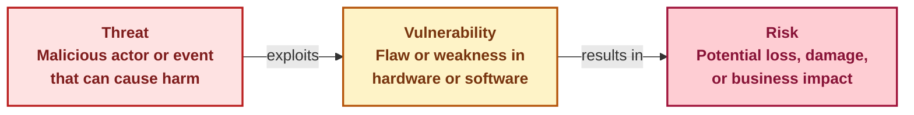

| Term | Exact Definition | Analogy |
|---|---|---|
| **Threat** | Any potential event, actor, or incident capable of causing harm to hardware, software, or digital assets | A malicious hacker / malware waiting outside a system, looking for a way in |
| **Vulnerability** | A flaw, weakness, or bug in software, apps, OS, or hardware that can be exploited for unauthorized entry | An unlocked window or structural weakness in a building |
| **Risk** | Potential financial loss, operational interruption, system damage, or data destruction when a threat exploits a vulnerability | The actual damage (downtime, stolen funds) when the burglar enters through the unlocked window |

> [!question]+ 🎤 Interview Deep-Dive: Threat vs. Risk
> **Q: "How do you differentiate between a Threat and a Risk?"**
> A **Threat** is the external agent/event capable of causing harm (e.g., malware strain, hacker group). A **Risk** is the *calculated impact or business loss* that results if that threat succeeds in exploiting a weakness.

---

## 3. The CIA Triad

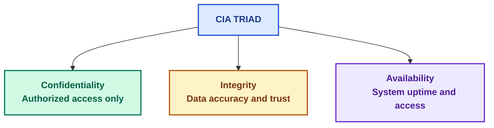

### 3.1 Component Breakdown

> [!note]+ 1️⃣ Confidentiality (C)
> **Definition:** Ensuring sensitive corporate/user data is accessed exclusively by authorized individuals/systems — preventing unauthorized disclosure, leaks, or exposure.
> **Example:** Private messages on Gmail/Facebook must remain inaccessible to outside/unauthorized users.

> [!note]+ 2️⃣ Integrity (I)
> **Definition:** Ensuring data remains complete, accurate, trustworthy, and uncorrupted — preventing unauthorized modification, tampering, deletion, or malware injection.
> **Example:** An Android developer uploads an APK to the Play Store. Integrity ensures no middleman can modify the code or inject malware during transmission.

> [!note]+ 3️⃣ Availability (A)
> **Definition:** Guaranteeing systems, networks, applications, and data remain operational and accessible to authorized users whenever required.
> **Example:** Facebook/Gmail must stay online and reachable, resisting disruptions like DDoS attacks.

### 3.2 CIA Triad Summary Matrix

| CIA Element | Core Security Goal | Primary Threat Vector | Real-World Example |
|---|---|---|---|
| **Confidentiality** | Restrict data access to authorized users | Unauthorized disclosure, eavesdropping, credential theft | Encrypted logins on Gmail/Facebook |
| **Integrity** | Preserve data accuracy, prevent tampering | Unauthorized code modification, malware injection, corruption | Code signing & hash verification for APKs |
| **Availability** | Guarantee uptime & access | DDoS attacks, server outages, crashes | Continuous cloud infrastructure uptime |

---

## 4. Common Cyber Threats & Attack Types

### 4.1 Threat Categories

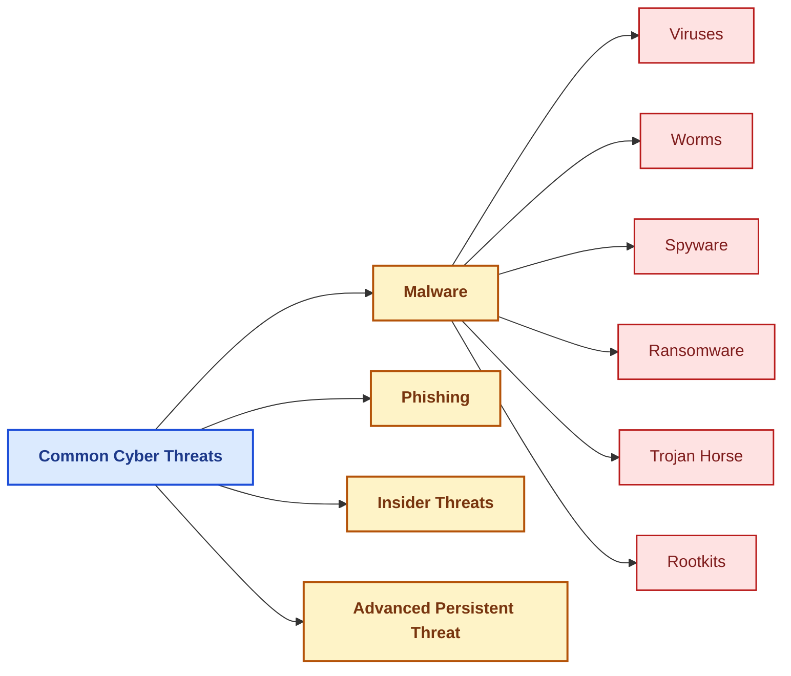

| Threat | Mechanics |
|---|---|
| **Malware** | Umbrella term for malicious programs designed to damage, steal, or gain unauthorized control |
| ↳ Viruses | Self-replicating, attach to legitimate files |
| ↳ Worms | Standalone, spread autonomously across networks |
| ↳ Spyware | Covertly monitors behavior, steals keystrokes/data |
| ↳ Ransomware | Encrypts data, demands payment for decryption |
| ↳ Trojan Horse | Malicious code disguised as legitimate software |
| ↳ Rootkits | Cloaking software providing elevated access while hiding presence |
| **Phishing** | Deceptive emails/fraudulent links/spoofed pages to trick users into submitting credentials or clicking malicious links |
| **Insider Threats** | Risks from current/former employees, contractors, partners — leaking data knowingly or unknowingly |
| **APT** (Advanced Persistent Threat) | Highly targeted, stealthy, continuous espionage by sophisticated/state-sponsored actors for prolonged access |

### 4.2 Common Attack Mechanics

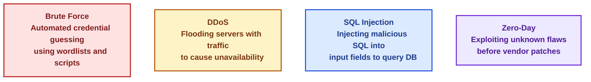

> [!abstract]+ Attack Type Details
> **1. Brute Force Attack**
> Automated tools + password dictionary wordlists systematically guess credentials via rapid, repeated failed login attempts until the correct password is found.
>
> **2. DDoS (Distributed Denial of Service)**
> Flooding a target application/server/network with massive traffic from multiple compromised sources to consume resources and crash service.
> *Analogy:* High traffic during a *Squid Game* Netflix release caused temporary unavailability — DDoS replicates this intentionally with malicious traffic.
>
> **3. SQL Injection (SQLi)**
> Malicious SQL statements injected into vulnerable input fields (search boxes, login forms) to manipulate backend queries — enabling unauthorized viewing, modification, or extraction of DB contents.
>
> **4. Zero-Day Vulnerability**
> A flaw disclosed on hacking forums or exploited in the wild *before* the vendor releases a patch. Attackers trade these exploits before defenders can patch.
> *(Note: the term "Zero-Day" is the origin of the channel name "ZeroDayVault")*

---

## 5. Real-World Incident Case Studies

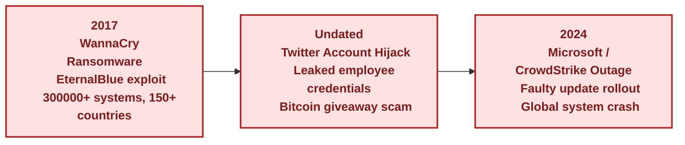

> [!failure]+ 1. WannaCry Ransomware (2017)
> - **Scope:** 300,000+ Windows machines across 150+ countries
> - **Attack Vector:** Exploited **EternalBlue** (Windows SMB vulnerability) to infect systems and encrypt hard drives
> - **Ransom Mechanism:** On-screen popup demanding Bitcoin payment for decryption key

> [!failure]+ 2. Twitter Account Hijack Scam
> - **Mechanics:** Compromised high-profile accounts broadcast fake Bitcoin giveaway scams ("send crypto, get double back")
> - **Root Cause:** Internal employee credential leaks and compromised internal tools

> [!failure]+ 3. Microsoft / CrowdStrike Server Outage (2024)
> - **Mechanics:** Faulty update rollout caused widespread global system crashes across enterprise Microsoft server infrastructure

---

## 6. The Cyber Kill Chain (7 Phases)

> [!info] Purpose
> Enables **SOC L1 Analysts** to identify the specific phase an active threat is in, evaluate adversary progress, and implement targeted countermeasures before the attacker reaches their final objective.
> ⭐ One of the **most frequently asked** SOC Analyst interview topics.

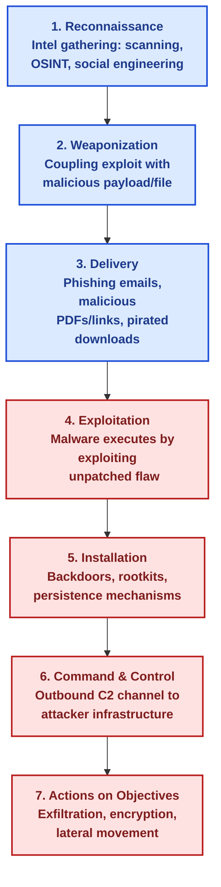

### 6.1 Phase-by-Phase Breakdown

| Phase | Name | Description |
|---|---|---|
| 1 | **Reconnaissance** | Gathering intelligence on target's IP ranges, employee emails, open ports, and vulnerabilities via active scanning or passive social engineering/OSINT |
| 2 | **Weaponization** | Pairing an exploit payload with a malicious delivery vehicle (malware binary, script, weaponized document) tailored to recon intel |
| 3 | **Delivery** | Transmitting payload via phishing emails, malicious attachments (PDFs, docs, images), malicious links, or pirated downloads |
| 4 | **Exploitation** | Victim opens/executes the file; exploit code triggers, taking advantage of an unpatched vulnerability (e.g., EternalBlue) |
| 5 | **Installation** | Malware installs itself, establishing persistent access via backdoors, registry entries, or rootkits that survive reboots |
| 6 | **Command & Control (C2)** | Compromised endpoint opens outbound channel to attacker's external infrastructure, enabling remote commands |
| 7 | **Actions on Objectives** | Adversary executes primary goal: data exfiltration, encrypting drives (ransomware), modifying data, lateral movement |

### 6.2 Kill Chain ↔ SOC Detection Mapping

| Phase | Attacker Technique / Vector | 🔍 SOC Detection Opportunity |
|---|---|---|
| **1. Reconnaissance** | Port scanning, WHOIS lookups, OSINT, social engineering | Firewall logs flagging port sweeps & IP recon |
| **2. Weaponization** | Coupling exploit payload with malicious scripts/files | YARA rules & static file analysis via VirusTotal |
| **3. Delivery** | Phishing emails, malicious attachments, pirated downloads | Email Gateway alerts & URL Filtering blocks |
| **4. Exploitation** | Executing exploit code against unpatched flaws | EDR process creation alerts & Vulnerability Scanning |
| **5. Installation** | Deploying backdoors, rootkits, startup registry keys | Endpoint Integrity Monitoring (FIM) & host logs |
| **6. Command & Control** | Covert outbound HTTP/DNS channels to remote servers | DNS logs flagging beaconing & suspicious domain lookups |
| **7. Actions on Objectives** | Data exfiltration, file encryption, lateral movement | SIEM alerts for mass file modifications or unusual egress traffic |

---

## 7. Defense-in-Depth (The "Onion" Model)

> [!tip]+ Core Concept
> Security must never rely on a single defensive boundary. It must be structured as **multiple overlapping, concentric layers**. If an attacker bypasses one layer, subsequent controls prevent full compromise.

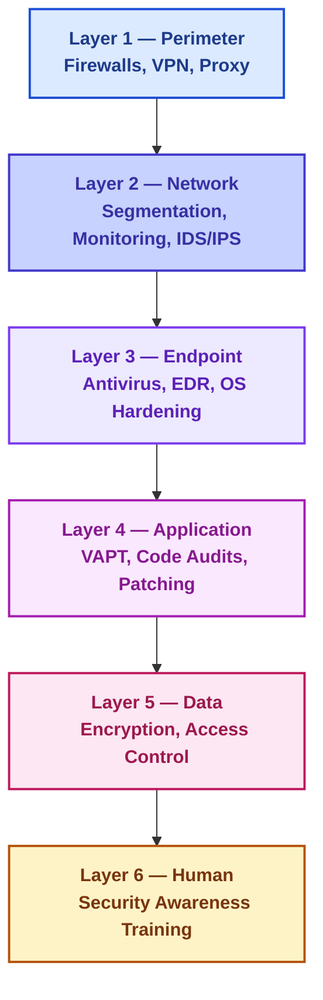

### 7.1 Layer-by-Layer Breakdown

| Layer | Focus | Mechanisms | Analogy |
|---|---|---|---|
| **1. Perimeter Security** | Outer network boundary | Firewalls, VPNs, Proxy Servers inspecting/filtering border traffic | Armed forces securing physical borders |
| **2. Network Security** | Internal traffic & architecture | Network segmentation, continuous monitoring, IDS/IPS | Contains lateral movement |
| **3. Endpoint Security** | Host devices | OS hardening, disabling unused ports/services, Antivirus, EDR | Isolates/removes malicious programs |
| **4. Application Security** | Software, web portals, apps | Regular VAPT, code audits, patch management | Eliminates flaws before exploitation |
| **5. Data Security** | Sensitive data | Encryption (at rest & in transit), strict access controls | Protects the "crown jewels" |
| **6. Human Security** | People / behavior | Regular security awareness training | Prevents phishing & social engineering success |

### 7.2 Email & Web Security Sub-Domains

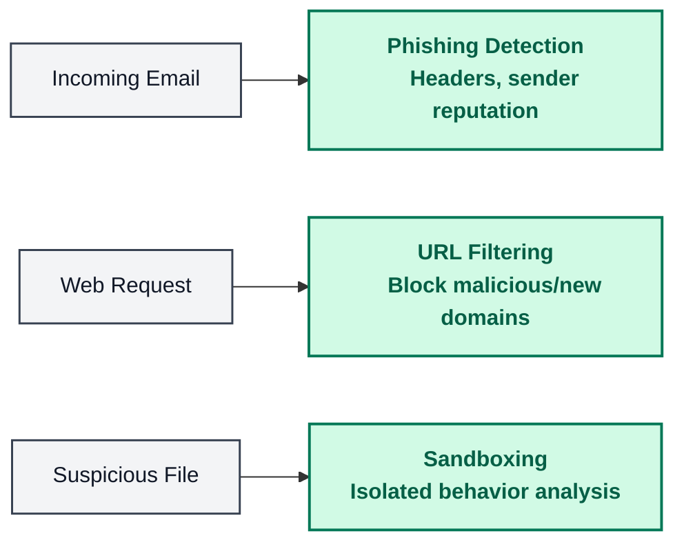

- **Phishing Detection**: Analyzing email headers, sender reputations, and attachments to catch malicious emails before reaching inboxes
- **URL Filtering**: Automated proxy policies blocking access to known dangerous/malicious/newly-registered domains
- **Sandboxing**: Executing suspicious files in an isolated environment to observe runtime behavior safely

---

## 8. SIEM Technology & Log Source Analytics

### 8.1 What is a SIEM?
> **Security Information and Event Management (SIEM)**: a central platform that ingests, aggregates, normalizes, and correlates log data across the enterprise.

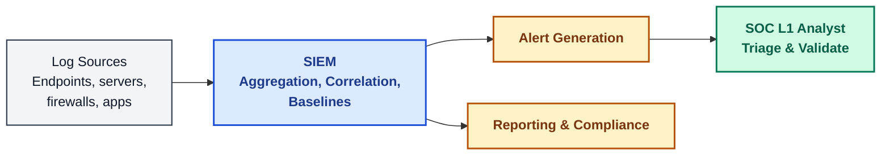

**Primary SIEM Functions:**
1. **Log Aggregation** — centralizes feeds from thousands of endpoints/servers/appliances into a unified database
2. **Real-Time Threat Detection** — correlation logic + baseline thresholds to detect automated threats
3. **Alert Generation** — real-time notifications for SOC analysts on suspicious activity
4. **Reporting & Compliance** — automated audit reports and metrics dashboards

### 8.2 Top Industry SIEM Platforms

| Platform | Type | Core Characteristics |
|---|---|---|
| **Splunk** | Enterprise Industry Standard | High-performance SPL search language, extensive log parsing, widely deployed |
| **IBM QRadar** | Enterprise Industry Standard | Advanced behavioral analytics, automated correlation rules |
| **LogRhythm** | Enterprise SIEM | Machine Data Intelligence (MDI), rapid incident response orchestration |
| **Sumo Logic** | Cloud-Native SIEM | Cloud-based log management, real-time security analytics |
| **Microsoft Sentinel** | Cloud-Native (Azure) | Scalable SIEM/SOAR deeply integrated with Microsoft 365 |

### 8.3 Core Log Sources

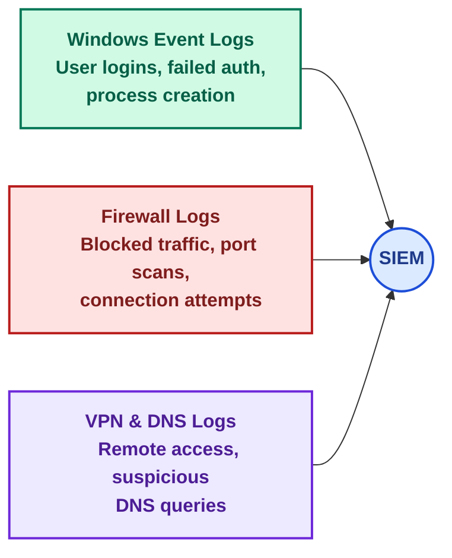

| Log Source | Telemetry & Events | Investigative Value |
|---|---|---|
| **Windows Logs** | User logon activity (success/failure Event IDs), process creation events, privilege modifications | Identifies credential theft, unauthorized access, brute force, malicious script execution |
| **Firewall Logs** | Blocked traffic records, port/vulnerability scan patterns, unusual outbound connections | Detects external recon, malicious IP connections, unauthorized egress |
| **VPN & DNS Logs** | VPN auth logs & session origins, DNS resolution queries, non-standard port queries | Flags suspicious remote logins from unusual geo-locations, uncovers C2 domain beaconing |

---

## 9. Incident Detection, Triage & Use Cases

### 9.1 Automated Detection vs. Analyst Validation
> The SOC L1 analyst's job is **not** to manually read raw logs line-by-line, but to investigate triggered alerts, validate **True Positive** vs. **False Positive**, gather evidence, and escalate confirmed incidents.

### 9.2 Essential SOC L1 Use Cases

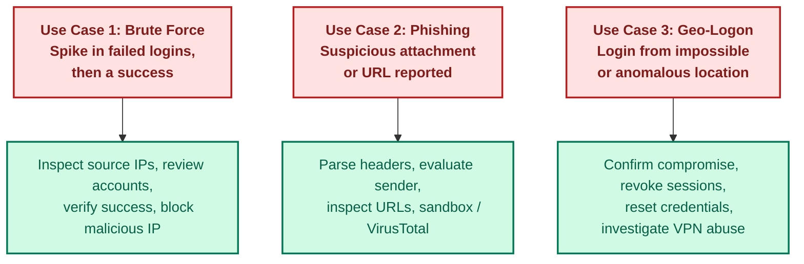

| Use Case | Log Signal | Analyst Action |
|---|---|---|
| **Brute Force Detection** | Rapid repeated failed auth events against an account, short timeframe, automated tools | Inspect source IPs, review target accounts, verify eventual success, block malicious IPs at firewall |
| **Phishing Investigation** | Employee reports suspicious email with link/attachment | Parse headers, evaluate sender legitimacy, inspect URLs, sandbox/VirusTotal analysis |
| **Geo-Logon / Impossible Travel** | Same account authenticates from two distant locations in an impossible timeframe (e.g., India → Europe in 10 min) | Confirm compromise, revoke sessions, reset credentials, investigate VPN endpoint abuse |

---

## 10. Best Practices

> [!success]+ Core Organizational Security Controls
> - 🔑 **Strong Password Policies & MFA** — complex passwords + mandatory Multi-Factor Authentication on all corporate portals
> - 🩹 **Regular Software Patching** — frequently update OS and applications to remediate vulnerabilities
> - 🌐 **Network Border Isolation** — avoid public/unencrypted Wi-Fi for sensitive corporate access
> - 🎓 **Continuous Employee Awareness** — regular training to stay vigilant against social engineering

---

## 11. Hands-On Assignments

### 11.1 Assignment Workflow Overview

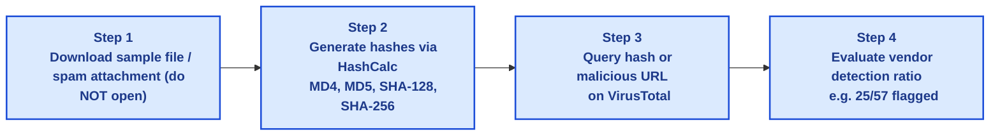

> [!example]+ Assignment 1 — Malicious URL/File/Hash Analysis via VirusTotal
> **Objective:** Analyze suspicious links, files, and hashes using threat intelligence platforms.
>
> **Tools:**
> - **VirusTotal** (`virustotal.com`) — File / URL / Search modules (supports IPs, domains, URLs, hashes)
> - **VirusShare** (`virusshare.com`) — public repository of malicious hash samples
> - **HashCalc** — desktop hash generator (MD4, MD5, SHA-128, SHA-256, SHA-1)
>
> **Option A — URL Analysis:** Input a suspicious URL into VirusTotal's URL/Search section → review vendor detection scores.
> **Option B — Known Hash Lookup:** Copy a hash from VirusShare → paste into VirusTotal → inspect vendor detections (demo: **25/57 vendors flagged**).
> **Option C — File & Hash Workflow:** Download a file/attachment from spam folder (⚠️ do NOT open/execute) → generate hash via HashCalc → submit file or SHA-256 hash to VirusTotal → verify authenticity/malicious flags.

> [!example]+ Assignment 2 — WHOIS Lookup & IP Reputation Check
> **Objective:** Investigate domain ownership, registration metadata, and IP reputation.
>
> **Tools:** `whois` (Kali Linux terminal or web tools), IP reputation engines (e.g., **AbuseIPDB**)
>
> **Workflow:**
> 1. Select a target domain/external IP
> 2. Run WHOIS lookup → extract creation dates, registrar contacts, name servers
> 3. Submit IP to reputation engines → analyze abuse reports, geographic origin, ASN

> [!example]+ Assignment 3 — Password Strength Analysis
> **Objective:** Evaluate password complexity, entropy, and cracking resistance.
>
> **Workflow:**
> 1. Access a password strength testing tool (from session tracker)
> 2. Test weak strings (e.g., `Hello123`) → observe low resistance warnings
> 3. Test combinations of letters, digits, uppercase, special symbols
> 4. Observe: **length + character complexity together** are mandatory — reducing length lowers security even with symbols present

### 11.2 Assignments Summary Matrix

| Assignment | Focus Domain | Key Tools | Input Artifacts | Target Output |
|---|---|---|---|---|
| **1** | Threat Intel & Artifact Scanning | VirusTotal, VirusShare, HashCalc | Malicious URLs, spam attachments, MD5/SHA-256 hashes | Vendor detection ratios (e.g., 25/57), threat classification |
| **2** | Domain & IP Triage | WHOIS (Kali/Web), IP Reputation Engines | Target domains, foreign IPs | Creation dates, name servers, ASN, abuse confidence scores |
| **3** | Auth & Password Hardening | Interactive Password Strength Tester | Test passwords (`Hello123` vs. complex) | Entropy rating, length evaluation, brute-force resistance |

---

## 12. Q&A Insights & Career Guidance

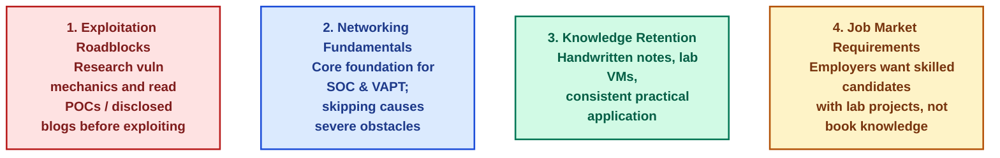

### 12.1 Overcoming Exploitation Roadblocks
> [!question]+ Q (Pradeep Singh): "Why do I feel stuck at the exploitation phase, even though I understand vulnerability scanning up to discovery?"
>
> **Root Cause:** Getting stuck happens when attempting to launch an exploit without deeply understanding the underlying vulnerability mechanics.
>
> **Actionable Solution:**
> 1. Thoroughly research the specific vulnerability type & affected component before launching exploit scripts
> 2. Read disclosed **POC (Proof of Concept)** docs, public advisories, vulnerability blogs, technical disclosure forums
> 3. Understand exact trigger conditions to construct/modify a working exploit payload effectively

### 12.2 The Essential Role of Networking Fundamentals
> [!warning]+ Common Pitfall
> Many beginners skip **Networking Fundamentals** (view it as "boring") and jump straight into TryHackMe / Hack The Box / vulnerable VMs.

- **Networking is the bedrock** of all cybersecurity sub-domains: Blue Team SOC, VAPT, Red Teaming
- Without a deep grasp of **IP addressing, TCP/UDP, ports, MAC addresses, Linux/Windows Server mechanics**, analysts face major hurdles analyzing live logs or packet captures
- **Roadmap:** Day 4 of this training series is dedicated to Networking Fundamentals (public vs. private IPs, port functions, protocol suites, network topologies) before advancing to log monitoring

### 12.3 Knowledge Retention Strategies
> [!question]+ Q (Pradeep): "I understand concepts while reading, but forget terminology/workflow after 1–2 months."

| Strategy | Description |
|---|---|
| ✍️ **Handwritten Note-Taking** | Read PDFs/books, write personal notes by hand — physical writing trains retention |
| 🖥️ **Controlled Lab Environments** | Set up local VMs, or use beginner rooms on TryHackMe/Hack The Box |
| 🔁 **Continuous Implementation** | Terminology & CLI commands stick when applied repeatedly in real tasks, not passive reading |

### 12.4 SOC vs. Penetration Testing — Job Market Dynamics
> [!question]+ Q (Himanshu): "Is it easier to get a job as a SOC Analyst or as a Penetration Tester?"
>
> - Neither is "easy" without verified technical competence
> - **Skill Demand Gap:** Employers rarely want purely theoretical book knowledge — they demand **skilled professionals** with practical problem-solving ability
> - **Key Hiring Differentiators:** hands-on lab work, completed practical projects, lab challenge write-ups, strong grasp of core concepts

---

## 13. Program Logistics

> [!info]+ Schedule & Milestones
> - **Course Cost:** 100% free, sessions archived permanently on YouTube
> - **Adjusted Schedule (this week only):** 4 sessions — **Mon, Tue, Thu, Fri @ 8:30 PM IST** (to finish Networking Fundamentals + Linux OS without spillover)
> - **Standard Schedule (resumes after):** Mon, Wed, Fri @ 8:30 PM IST
> - **Community Milestone:** Reaching **5,000 subscribers** on **ZeroDayVault** triggers launch of an advanced, fully practical **Ethical Hacking Series**

---

## 🧩 Quick Reference: Full Session Overview

```mermaid
flowchart TD
    Root[SOC Analyst L1 — Day 3]

    Root --> CD[Core Definitions]
    CD --> CD1[Threat]
    CD --> CD2[Vulnerability]
    CD --> CD3[Risk]

    Root --> CIA[CIA Triad]
    CIA --> CIA1[Confidentiality]
    CIA --> CIA2[Integrity]
    CIA --> CIA3[Availability]

    Root --> TA[Threats & Attacks]
    TA --> TA1[Malware / Phishing / Insider / APT]
    TA --> TA2[Brute Force / DDoS / SQLi / Zero-Day]

    Root --> KC[Cyber Kill Chain]
    KC --> KC1[Recon → Weaponize → Deliver]
    KC --> KC2[Exploit → Install → C2 → Actions]

    Root --> DD[Defense in Depth]
    DD --> DD1[Perimeter → Network → Endpoint]
    DD --> DD2[Application → Data → Human]

    Root --> SI[SIEM]
    SI --> SI1[Splunk, QRadar, LogRhythm]
    SI --> SI2[Sumo Logic, MS Sentinel]

    Root --> AS[Assignments]
    AS --> AS1[VirusTotal hash/URL scan]
    AS --> AS2[WHOIS + IP reputation]
    AS --> AS3[Password strength test]

    classDef root fill:#1e3a8a,stroke:#1e40af,stroke-width:2px,color:#ffffff,font-weight:bold
    classDef branch fill:#dbeafe,stroke:#1d4ed8,stroke-width:2px,color:#1e3a8a,font-weight:bold
    classDef leaf fill:#f3f4f6,stroke:#6b7280,stroke-width:1.5px,color:#111827

    class Root root
    class CD,CIA,TA,KC,DD,SI,AS branch
    class CD1,CD2,CD3,CIA1,CIA2,CIA3,TA1,TA2,KC1,KC2,DD1,DD2,SI1,SI2,AS1,AS2,AS3 leaf
```

---

> [!quote]+ Next Steps (Instructor Suggested)
> - Day 4 → Networking Fundamentals (public/private IPs, ports, protocols, topologies)
> - Consider building a **Master Study Guide** across Day 1–3
> - Optional: 20-question practice exam covering SOC fundamentals, threat intel tools, and kill chain frameworks

---
#soc #cybersecurity #killchain #siem #defense-in-depth #cia-triad #blueteam
